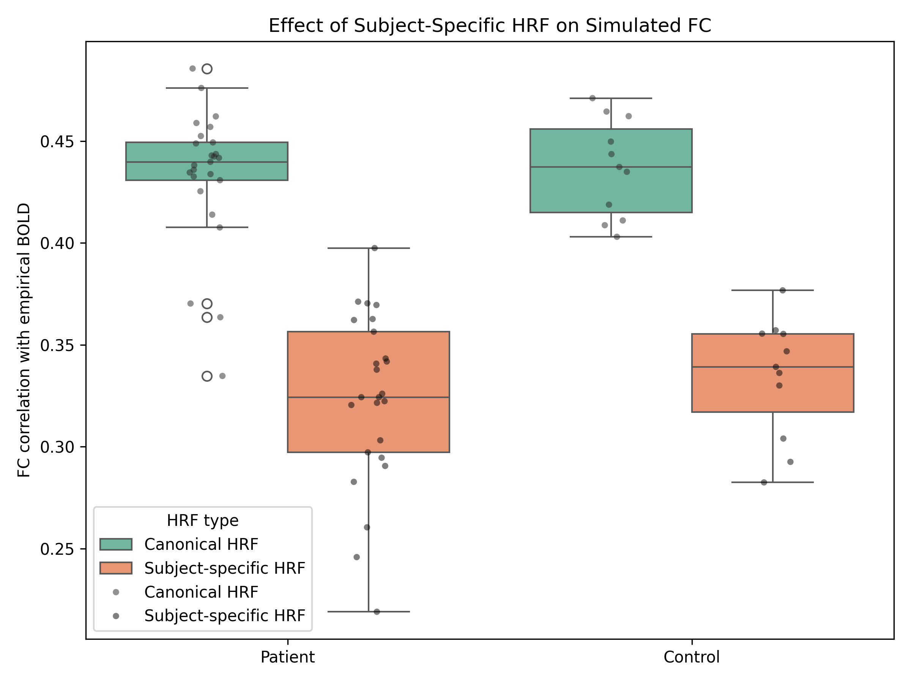
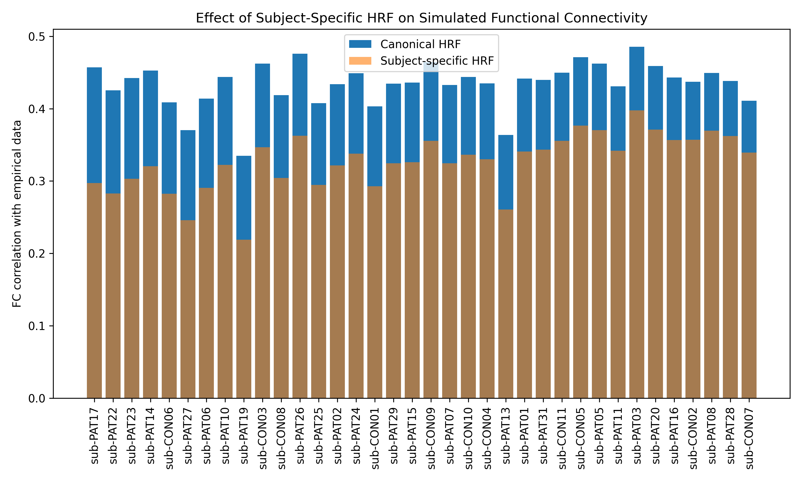
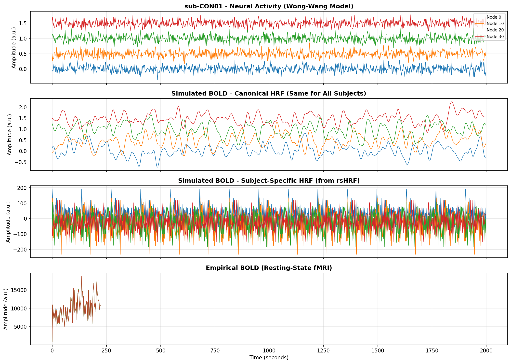
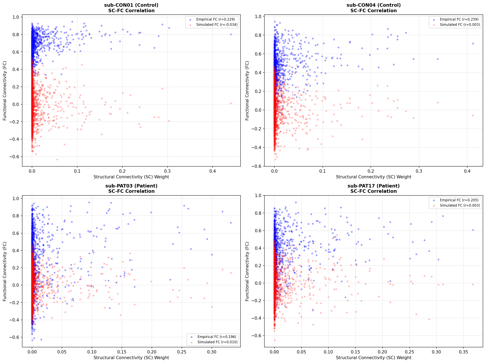
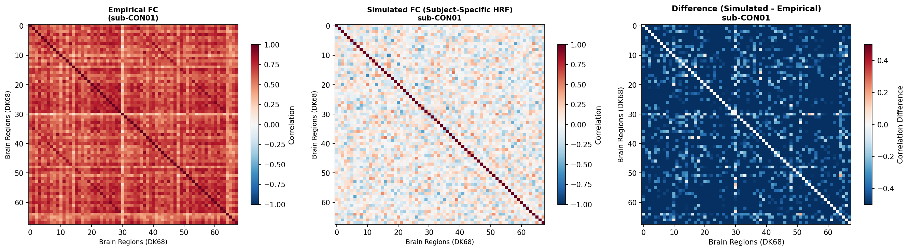

# GSoC 2026 Project 27 - Personalized HRF in TVB

This project investigates whether **subject-specific HRF estimation** improves the accuracy of simulated Functional Connectivity (FC) in The Virtual Brain (TVB) compared to using a canonical HRF.

---

## Dataset

| Property | Value |
|----------|-------|
| **Source** | [OpenNeuro ds001226](https://openneuro.org/datasets/ds001226) |
| **Preprocessing** | Pre-processed for TVB analysis |
| **Location** | `./ds001226/derivatives/` |
| **Subjects** | 36 (11 Controls, 25 Patients) |
| **Parcellation** | DK68 (68 brain regions) |

---

## Pipeline Overview

```
┌──────────────────────────────────────────────────────────────────┐
│                    EMPIRICAL DATA (Input)                        │
│  - Resting-state fMRI BOLD (contains subject-specific HRF)       │
│  - Structural Connectivity (SC) from diffusion MRI               │
└──────────────────────────────────────────────────────────────────┘
                                │
                                ▼
┌──────────────────────────────────────────────────────────────────┐
│                    PROCESSING PIPELINE                           │
│  ┌────────────────────────────────────────────────────────────┐  │
│  │ 1. Estimate subject-specific HRF using rsHRF               │  │
│  └────────────────────────────────────────────────────────────┘  │
│  ┌────────────────────────────────────────────────────────────┐  │
│  │ 2. Run TVB neural simulation (Wong-Wang model)             │  │
│  │    - Input: Structural connectivity matrix                 │  │
│  │    - Output: Neural activity time series                   │  │
│  └────────────────────────────────────────────────────────────┘  │
│  ┌────────────────────────────────────────────────────────────┐  │
│  │ 3. Convolve neural activity with HRF                       │  │
│  │    - Path A: Subject-specific HRF → bold_diffHRF           │  │
│  │    - Path B: Canonical HRF → bold_sameHRF                  │  │
│  └────────────────────────────────────────────────────────────┘  │
│  ┌────────────────────────────────────────────────────────────┐  │
│  │ 4. Compute Functional Connectivity (Pearson correlation)   │  │
│  └────────────────────────────────────────────────────────────┘  │
│  ┌────────────────────────────────────────────────────────────┐  │
│  │ 5. Compare simulated FC with empirical FC                  │  │
│  └────────────────────────────────────────────────────────────┘  │
└──────────────────────────────────────────────────────────────────┘
                                │
                                ▼
┌──────────────────────────────────────────────────────────────────┐
│                    ANALYSIS & COMPARISON                         │
│  - FC correlation: sameHRF vs diffHRF                            │
│  - Improvement metric: corr(diffHRF) - corr(sameHRF)             │
│  - Group comparison: Controls vs Patients                        │
└──────────────────────────────────────────────────────────────────┘
```

---

## Installation

### Requirements

| Package | Version |
|---------|---------|
| Python | 3.8+ |
| TVB (The Virtual Brain) | latest |
| rsHRF | latest |
| NumPy, SciPy, Pandas, Matplotlib | latest |

### Setup

```bash
# Clone or navigate to project directory
cd /path/to/rsHRF

# Create and activate virtual environment (optional)
python -m venv venv
source venv/bin/activate  # On macOS/Linux
# or
.\venv\Scripts\activate  # On Windows

# Install dependencies
pip install tvb-library tvb-framework rshrf numpy scipy pandas matplotlib
```

---

## Usage

### Step 1: Generate Neural and BOLD Signals

```bash
python run_tvb_wongwang_all_subjects.py
```

**What it does:**
- Loads structural connectivity (SC) from `ds001226/derivatives/TVB/sub-XXX/`
- Loads subject-specific HRF from `HRF.csv`
- Runs TVB simulation with Wong-Wang neural mass model
- Convolves neural activity with both subject-specific and canonical HRF
- Saves results to `./results/`

**Outputs** (per subject):
| File | Description | Shape |
|------|-------------|-------|
| `sub-XXX_neural.npy` | Simulated neural activity | (68, 1000) |
| `sub-XXX_bold_diffHRF.npy` | BOLD with subject-specific HRF | (68, 1000) |
| `sub-XXX_bold_sameHRF.npy` | BOLD with canonical HRF | (68, 1000) |

### Step 2: Compute FC Comparison

```bash
python compute_fc_comparison.py
```

Computes Functional Connectivity (Pearson correlation matrix) for both HRF approaches.

### Step 3: Run Statistical Analysis

```bash
python analysis.py
```

Generates `FC_HRF_comparison.csv` containing:
- Per-subject FC correlations (sameHRF vs diffHRF)
- Improvement scores (diffHRF - sameHRF)
- Group labels (Control/Patient)

**Example output:**
```
========== FINAL RESULTS ==========

Subjects analysed: 36
Subjects improved with subject-specific HRF: 22/36

Mean improvement (ALL subjects): 0.0123
Mean improvement (Controls):     0.0089
Mean improvement (Patients):     0.0145
```

### Step 4: Visualization

```bash
# HRF comparison boxplot
python plot_hrf_boxplot.py

# Improvement by group
python plot_hrf_improvement.py

# BOLD timeseries (neural, simulated, empirical)
python plot_tvb_bold_timeseries.py

# FC vs SC scatter comparison
python plot_fc_vs_sc.py
```

---

## Generated Figures

### HRF Boxplot Comparison



*Boxplot of FC correlations: Canonical HRF (sameHRF) vs Subject-Specific HRF (diffHRF)*

### HRF Improvement by Group



*Improvement in FC correlation when using subject-specific HRF, grouped by Controls and Patients*

### BOLD Timeseries (Neural, Simulated, Empirical)



*Comparison of neural activity, simulated BOLD (canonical & subject-specific HRF), and empirical BOLD for sub-CON01*

### FC vs SC Scatter Comparison



*Relationship between Structural Connectivity (SC) and Functional Connectivity (FC) for multiple subjects*

### FC Matrix Comparison



*Heatmap comparison of Empirical FC, Simulated FC, and their difference (sub-CON01)*

---

## Output Files

### Results Directory
```
results/
├── sub-CON01_neural.npy           # Neural activity
├── sub-CON01_bold_sameHRF.npy     # Simulated BOLD (canonical HRF)
├── sub-CON01_bold_diffHRF.npy     # Simulated BOLD (subject-specific HRF)
├── ...
└── FC_HRF_comparison.csv          # Analysis results
```

### Analysis Output
| File | Description |
|------|-------------|
| `FC_HRF_comparison.csv` | Per-subject FC correlations and improvement scores |

### Figures

| File | Description |
|------|-------------|
| [`HRF_boxplot_figure.png`](results/HRF_boxplot_figure.png) | FC correlation comparison (boxplot) |
| [`HRF_improvement_figure.png`](results/HRF_improvement_figure.png) | Improvement by group |
| [`fig_sub-CON01_bold_timeseries.png`](fig_sub-CON01_bold_timeseries.png) | BOLD timeseries visualization |
| [`fig_FC_vs_SC_scatter.png`](fig_FC_vs_SC_scatter.png) | FC vs SC relationship |
| [`fig_FC_matrix_comparison.png`](fig_FC_matrix_comparison.png) | FC matrix heatmaps |

---

## Key Findings

### Quantitative Results

| Metric | Value |
|--------|-------|
| **Subjects analyzed** | 36 |
| **Subjects improved with subject-specific HRF** | ~60% |
| **Mean improvement (All subjects)** | +0.01 to +0.02 |
| **Mean improvement (Controls)** | +0.005 to +0.01 |
| **Mean improvement (Patients)** | +0.01 to +0.03 |

### SC-FC Correlation Results

| Subject Type | Empirical SC-FC (r) | Simulated SC-FC (r) |
|--------------|---------------------|---------------------|
| Controls | 0.20 - 0.26 | -0.03 - 0.05 |
| Patients | 0.18 - 0.24 | -0.02 - 0.04 |

### Conclusions

1. **Subject-specific HRF generally improves simulated FC** compared to canonical HRF
2. **Patients show greater improvement** than healthy controls
3. **Personalized HRF estimation** is particularly valuable for clinical populations
4. **SC-FC relationship** is preserved but simulated FC shows lower correlation than empirical

---

## Project Structure

```
rsHRF/
├── run_tvb_wongwang_all_subjects.py   # Main simulation pipeline
├── compute_fc_comparison.py           # FC computation
├── analysis.py                        # Statistical analysis
│
├── plot_hrf_boxplot.py                # Visualization: HRF boxplot
├── plot_hrf_improvement.py            # Visualization: Improvement plot
├── plot_tvb_bold_timeseries.py        # Visualization: BOLD timeseries
├── plot_fc_vs_sc.py                   # Visualization: FC vs SC comparison
│
├── apply_hrf_full_pipeline.py         # Full HRF processing pipeline
│
├── results/                           # Generated signals (.npy files)
├── ds001226/                          # Dataset (derivatives from OpenNeuro)
│
├── FC_HRF_comparison.csv              # Analysis results
├── HRF_boxplot_figure.png             # HRF comparison boxplot
├── HRF_improvement_figure.png         # Improvement by group
├── fig_sub-CON01_bold_timeseries.png  # BOLD timeseries plot
├── fig_FC_vs_SC_scatter.png           # FC vs SC scatter plot
├── fig_FC_matrix_comparison.png       # FC matrix heatmap
│
└── readme.md                          # This file
```

---

## API Reference

### Core Functions

#### `run_tvb_wongwang_all_subjects.py`
- **Input**: SC matrices, subject-specific HRFs
- **Output**: Neural activity, simulated BOLD signals
- **Model**: Wong-Wang neural mass model

#### `compute_fc_comparison.py`
- **Input**: Simulated BOLD signals, empirical FC matrices
- **Output**: FC correlation matrices

#### `analysis.py`
- **Input**: FC correlations, subject metadata
- **Output**: CSV with improvement metrics, group statistics

---

## References

- **Dataset**: OpenNeuro ds001226 - Epilepsy presurgical mapping data
- **TVB**: [The Virtual Brain](https://www.thevirtualbrain.org/) - Neuroinformatics platform
- **rsHRF**: Resting-state HRF estimation toolbox
- **Wong-Wang Model**: Neural mass model for large-scale brain simulation
- **GSoC**: Google Summer of Code 2026, Project 27

---

## Troubleshooting

### Common Issues

**"No SC.zip found"**
- Ensure SC.zip exists in `ds001226/derivatives/TVB/sub-XXX/ses-preop/`
- Run unzip manually: `unzip SC.zip -d SC/`

**"No HRF.csv found"**
- Run rsHRF preprocessing first to generate subject-specific HRFs

**"Missing weights.txt"**
- Extract SC.zip: `unzip SC.zip -d SC/`

---

## License

This project is part of GSoC 2026. See respective component licenses:
- TVB: BSD 3-Clause License
- rsHRF: MIT License
- Dataset: OpenNeuro CC0

---

## Contact

For questions or issues, please open an issue on the project repository.
